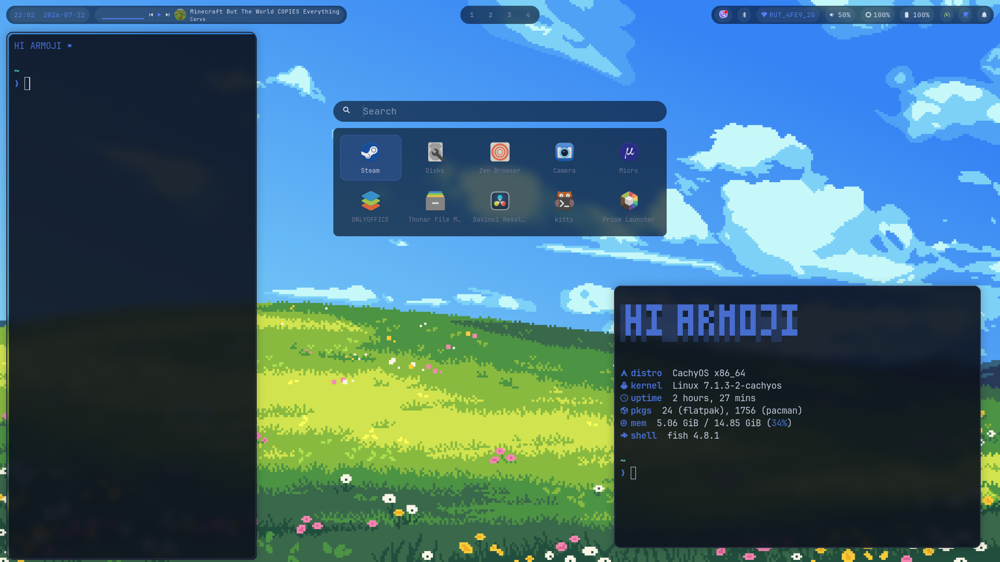

# armojidots



My SwayFX dotfiles — built from scratch, one step at a time.

> Status: **daily-drivable** — glass-pill bar with a live media pill, custom
> capsule Spotlight launcher, custom autohide dock, Windows-11-style
> volume/brightness OSD, dynamic palette theming, wallpaper picker, sidebars,
> lock screen + idle, GTK theming.

> [!WARNING]
> This is mostly **vibecoded** and tailored specifically to my own machine,
> workflow, and taste — it's **not meant to be used as-is by other people**.
> Feel free to dig through it for ideas or steal a piece (Spotlight, the
> dock, the OSD, etc.) for your own setup, but don't expect it to work by
> just cloning and stowing on a different system.

## What's here

| Package | What it configures |
|---------|--------------------|
| `sway/` | SwayFX window manager |
| `waybar/` | Top status bar (workspaces, media pill, tray/system) |
| `spotlight/` | Custom Spotlight launcher (`armoji-spotlight` — GTK4 + elephant) |
| `dock/` | Custom autohide app dock (`armoji-dock` — GTK4 + layer-shell) |
| `osd/` | Volume/brightness pop-up pill (`armoji-osd` — GTK4 + layer-shell) |
| `systemd/` | User services — elephant, spotlight, dock, osd all run resident |
| `walker/`, `nwg-dock/` | Legacy launcher/dock — kept installed as fallbacks only |
| `foot/` | Terminal (colors generated by the theme engine) |
| `swaync/` | Notifications + control center (glass, theme-driven) |
| `swaylock/` | Lock screen (config generated by the theme engine) |
| `swayidle/` | Idle policy (lock / screen off / lock before sleep) |
| `fish/` | Shell config + HI ARMOJI fastfetch greeting |
| `fastfetch/` | Fetch config with custom ASCII logo |
| `starship/` | Prompt |
| `gtk/` | GTK 3/4 settings (adw-gtk3-dark) |
| `cursor/` | Xcursor default → Bibata-Modern-Classic |
| `icons/` | Custom dock icons for the sidebar terminals (foot + Claude) |
| `assets/` | Slot-Multicolor-Dark-Icons (not packaged anywhere — bundled + installed by script) |

## Setup

- **OS:** CachyOS (Arch)
- **WM:** [SwayFX](https://github.com/WillPower3309/swayfx) (git `0.6+` — for window animations)
- **Terminal:** [foot](https://codeberg.org/dnkl/foot)

## Install

```sh
sudo pacman -S wlroots0.20 foot stow waybar brightnessctl pavucontrol swaybg \
       nemo swaync swayidle autotiling grim slurp wl-clipboard jq cava \
       python-gobject gtk4 gtk4-layer-shell playerctl wireplumber
# swayfx-git (0.6+) for window animations — the tagged 0.5.3 has none
yay -S swayfx-git swaysome walker-bin swaylock-effects nwg-dock elephant-desktopapplications \
       elephant-calc elephant-runner elephant-websearch elephant-menus bluetuith-bin \
       bibata-cursor-theme
git clone https://github.com/Armoji-code/armojidots.git ~/dotfiles
cd ~/dotfiles
stow sway waybar spotlight dock osd systemd walker nwg-dock foot swaync swaylock \
     swayidle fish fastfetch starship gtk cursor icons
elephant service enable
systemctl --user enable --now armoji-spotlight.service armoji-dock.service armoji-osd.service
mkdir -p ~/Pictures/Wallpapers   # drop wallpapers here for /set wallpaper
./assets/install-icon-theme.sh  # extracts Slot-Multicolor-Dark-Icons to ~/.local/share/icons
```

Configs are symlinked into `~/.config` by [GNU Stow](https://www.gnu.org/software/stow/) — editing the live config edits the repo.

## Keybinds (so far)

| Keys | Action |
|------|--------|
| `Win+D` | Toggle Spotlight launcher (`armoji-spotlight`) |
| `Win+T` | Open terminal |
| `Win+E` | Open file manager (Nemo) |
| `Win+W` | Open browser (zen-browser) |
| `Win+Q` | Close window |
| `Win+Space` | Toggle floating |
| `Win+F` | Toggle fullscreen |
| `Win` + left-drag | Move window |
| `Win` + right-drag | Resize window |
| `Win+1…0` | Switch workspace (per-monitor, via [swaysome](https://gitlab.com/hyask/swaysome)) |
| `Win+Shift+1…0` | Move window to workspace and follow |
| `Win+Alt+1…0` | Move the whole workspace (all windows) to slot N and follow |
| `Win+Shift+S` | Region screenshot → clipboard + notification |
| `Win+R` | Toggle quick-access terminal sidebar (left, sticky across workspaces) |
| `Win+Shift+R` | Toggle Claude Code sidebar (same, runs `claude`) |
| `Win+N` | Toggle notification center (swaync) |
| `Win+L` | Lock screen (swaylock, wallpaper background) |
| Volume / Mute keys | `wpctl` (±5%, capped 100%) — pops the OSD pill; works on the lock screen |
| Mic-Mute key | `wpctl` mic toggle (no OSD) |
| Brightness Up/Down keys | `brightnessctl` ±5% — pops the OSD pill |
| Play/Pause · Next · Prev · Stop keys | `playerctl` |

## Spotlight

A **custom launcher** (`spotlight/.local/bin/armoji-spotlight`, GTK4 + Python)
that replaces walker on `Win+D`. It uses **elephant** as its search backend
(fuzzy app matching + usage ranking + calc) but owns the whole UI, so every
mode gets its own layout: a **5x2 grid of your most-used apps** when empty, a
**results list** as you type.

Two stacked pills: a **search capsule** on top and a **content panel** below.
The capsule is a **layer-shell surface** (so its blur clips to a true capsule
shape - a normal window's corners are clamped by SwayFX and can't) while the
panel is a **normal window** (so it keeps the open/close animation and grows
downward). It runs **resident** as a systemd user service, so `Win+D` opens it
instantly instead of cold-starting.

Hidden commands (type `/`):

| Command | Does |
|---------|------|
| `/power` | Lock / Logout / Suspend / Reboot / Shutdown |
| `/set` | Menu: **Colors**, **Tone**, **Wallpaper**, **Wi-Fi**, **Bluetooth** |
| `/set wallpaper` | Live **thumbnails** of every image in `~/Pictures/Wallpapers`; pick one to apply it (updates the `current` symlink, restarts swaybg, re-derives the palette if you're on the `wallpaper` theme) |
| `/web <query>` | Web search in the browser |
| `/bash <cmd>` | Run a shell command |
| `23*7`, `=2^10` | Inline math - Enter copies the result |

## Waybar

Top bar: clock, a **media pill**, workspaces (center), tray/system (right) —
every segment is a capsule. The media pill (only visible when a player is
active) shows, left to right: a live **cava** visualizer (waybar's own cava
module doesn't work on this build, so it's a custom script piping `cava`'s
raw output through block characters), prev/play-pause/next buttons, a
**circular cover-art** thumbnail (cropped from `mpris:artUrl`), and the
title + small artist line. All driven by `scripts/media.sh` via
`playerctl --follow` (no polling). Bar pills keep a fixed height even when
nothing's playing.

## Theming

`/set color` → pick a palette: **wallpaper** (extracted from the current
wallpaper — default, follows wallpaper changes), ruby, orange, dandelion,
emerald, cobalt, bubblegum, purpur, b&w. One seed color derives a six-role
family (accent, dim, bg, surface, fg, muted) which `scripts/theme.sh`
writes into waybar, foot (including the full terminal ANSI palette), sway
borders, walker, swaync, GTK 3/4 apps (full window tinting + accent) —
everything flips at once. `/set tone` (light / heavy / loud) is a master
intensity dial for how hard the palette sits on all of it. GTK windows
(Nemo, pavucontrol) also get slight transparency + SwayFX blur to match
the glass look.

**Icons:** [Slot-Multicolor-Dark-Icons](assets/) system-wide (GTK, waybar
tray, and both custom apps — they all resolve icon *names*, not app_ids
directly, via each window's `.desktop` file). Only the truly generic
folder icon gets hue-matched to the accent on every palette change —
Documents/Downloads/Music/Pictures/Videos/Desktop/etc. and anything with
its own branded icon (git, docker, steam, …) keep their own distinct
look on purpose, so folders stay visually identifiable. **Cursor:**
Bibata-Modern-Classic, set system-wide (GTK, Xcursor, the sway seat).

## Dock

A **custom autohide dock** (`dock/.local/bin/armoji-dock`, GTK4 +
gtk4-layer-shell) replacing nwg-dock. Two layer surfaces: a thin invisible
strip pinned to the bottom edge that reveals the dock on hover, and the dock
itself — a capsule pill that floats *over* windows (OVERLAY layer, reserves
no space) and auto-hides ~1s after you leave it. Each running window is an
icon (from the live sway tree); **click one to focus it** (jumps to its
workspace). No launcher button — Spotlight (`Win+D`) covers launching.

## OSD

A **Windows-11-style pop-up pill** (`osd/.local/bin/armoji-osd`) for volume
and brightness. It's an OVERLAY layer-shell surface, so it renders **above
fullscreen apps** too. Pressing a volume/brightness key (or scrolling the
bar's backlight icon) runs the real `wpctl`/`brightnessctl` change via
`scripts/osd.sh`, which then pushes the new level over a Unix socket to the
resident `armoji-osd` daemon — it pops in with an icon + thin progress bar
+ percentage, and auto-hides after ~1.4s.

## Lock & idle

`Win+L` locks (swaylock, current wallpaper as background, palette-driven
ring). Idle policy (`swayidle/config`): 5 min → lock, 10 min → screen off,
lock before sleep. The bar's auto-lock pill (󰅶 / 󰒲) toggles it via the
wlroots idle-inhibit protocol — **off by default** (󰅶 = staying awake);
click to arm (󰒲) and the idle timers kick in.

## Config structure

Modular, one file per concern — new features get their own module:

```
sway/.config/sway/
├── config           # entry point: variables + includes
├── input.conf       # touchpad/mouse (Windows-style scrolling)
├── keybinds.conf    # apps + window controls + Spotlight (Win+D)
├── media-keys.conf  # volume / brightness (→ osd.sh) / playback Fn keys (--locked)
├── workspaces.conf  # swaysome per-monitor workspaces
├── appearance.conf  # borders + gaps (12px edges, matching the bar)
├── effects.conf     # SwayFX: rounded corners, shadows, dim, blur, layer glass
├── animations.conf  # window open/close pop animation (swayfx-git 0.6+)
├── rules.conf       # window rules (spotlight windows, floating glass TUIs)
├── autostart.conf   # autotiling, waybar, swaync, swayidle, swaybg (+ resident services)
└── scripts/         # move-workspace, wallpaper-pick, sidebar, osd trigger, theme engine

waybar/.config/waybar/
├── config.jsonc     # clock | media pill | workspaces | tray/bt/net/audio/brightness/battery/power/auto-lock/notifs
├── scripts/         # power-profile toggle, media.sh (cava/cover/playpause/info)
└── style.css        # glass capsule pills on a transparent strip

spotlight/
├── .local/bin/armoji-spotlight                   # the launcher (GTK4 + elephant)
└── .config/armoji-spotlight/{style,colors}.css   # glass theme (colors from theme.sh)

dock/
├── .local/bin/armoji-dock                        # the dock (GTK4 + layer-shell)
└── .config/armoji-dock/{style,colors}.css

osd/
├── .local/bin/armoji-osd                         # the OSD (GTK4 + layer-shell)
└── .config/armoji-osd/{style,colors}.css

systemd/.config/systemd/user/    # resident user services (all LD_PRELOAD gtk4-layer-shell
├── elephant.service              # where needed) — restarted on session start
├── armoji-spotlight.service
├── armoji-dock.service
└── armoji-osd.service
```
